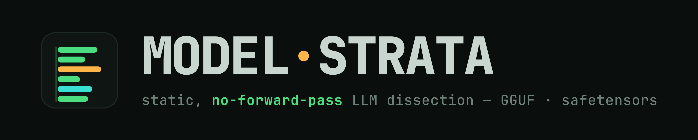
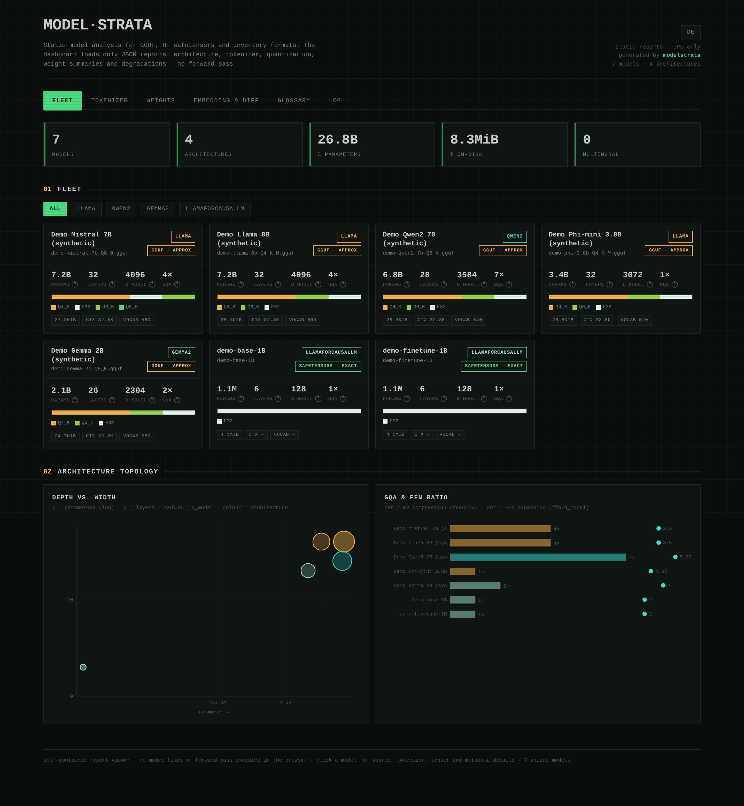
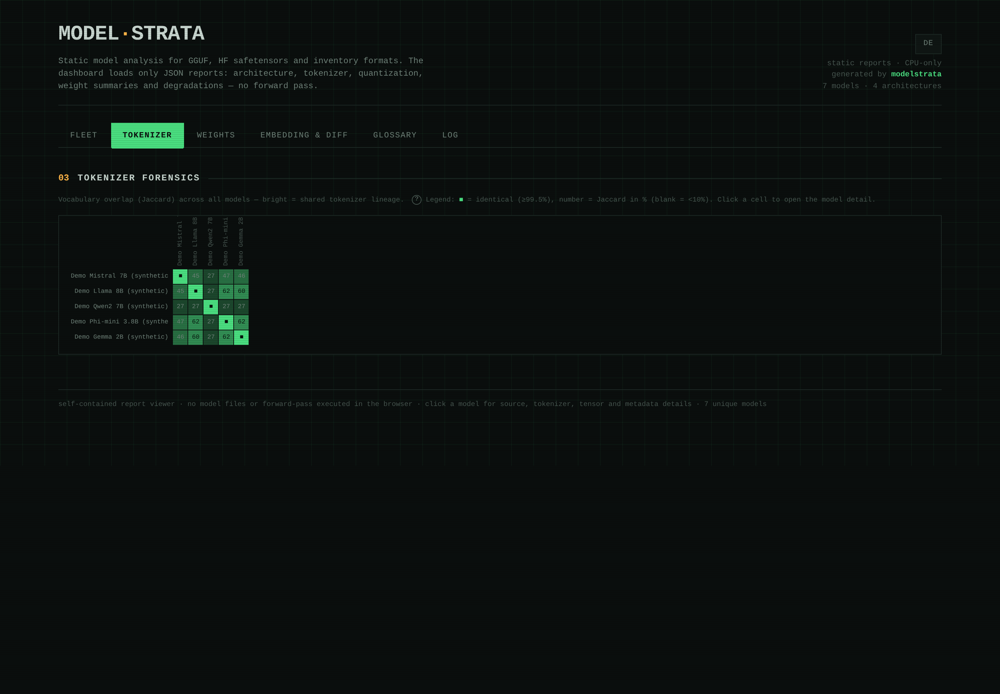
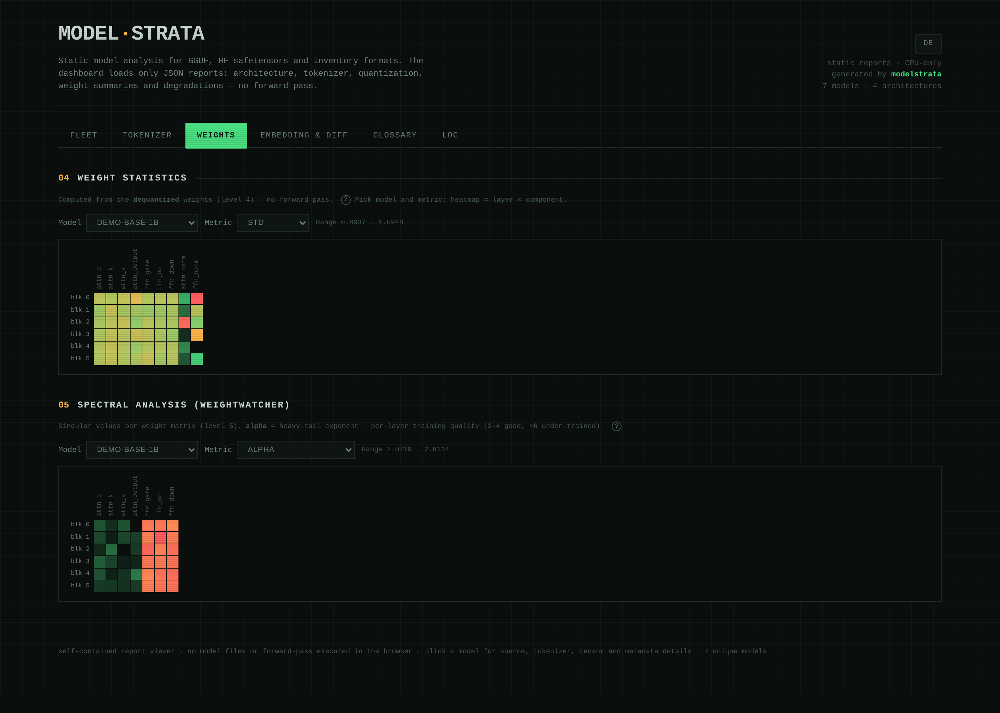
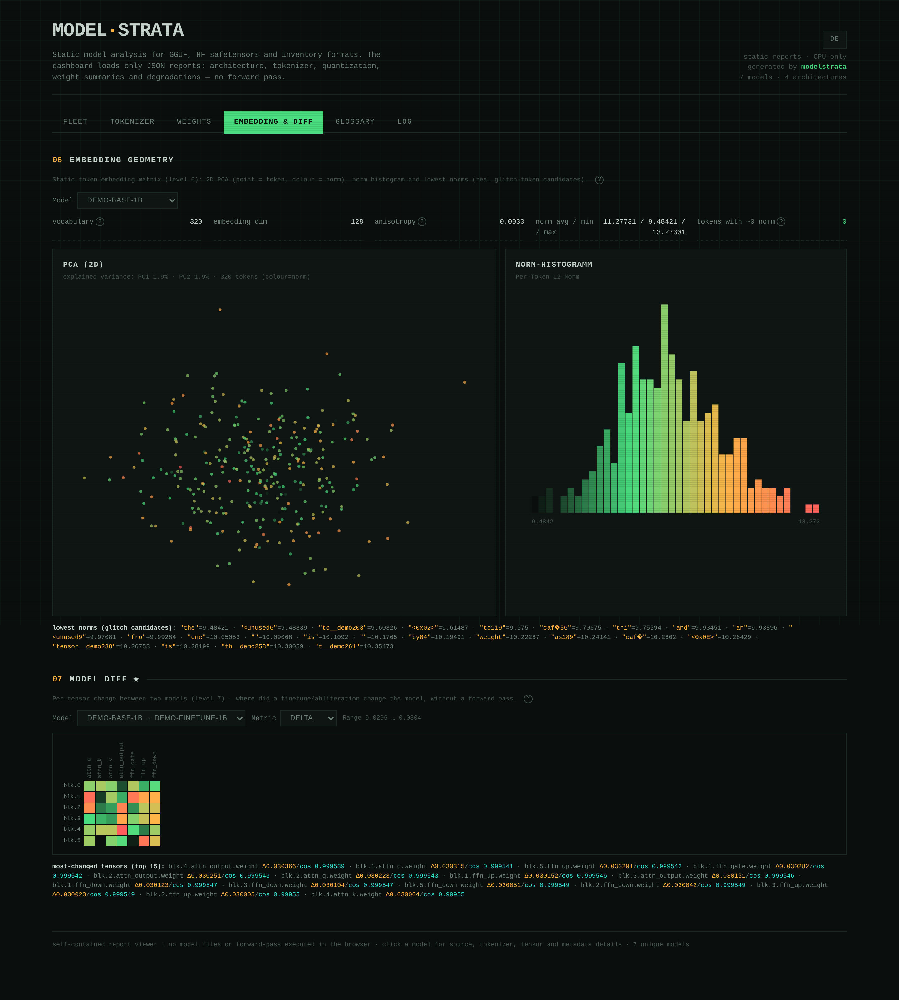
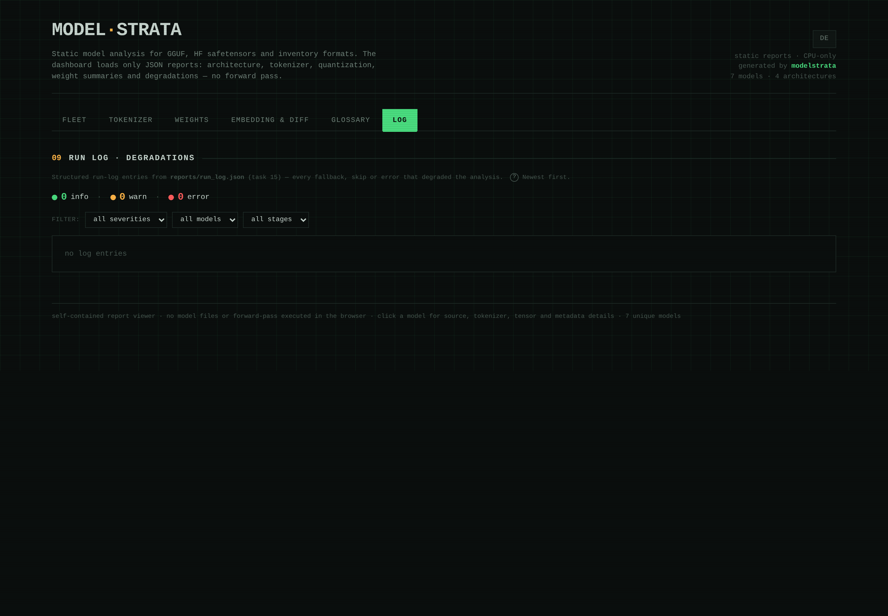

<p align="center">
  
</p>

<p align="center"><em><a href="README.md">Deutsch</a> · English</em></p>

<p align="center">
  <a href="https://c0decave.github.io/modelstrata/"><b>🔗 Live demo</b></a> — interactive dashboard (synthetic data)
</p>

# modelstrata

Static and (later) dynamic analysis of LLMs — *what is inside the models, without running them for inference.* The name: the dashboard peels a model into **strata** — header, tokenizer, weights, spectrum, embedding, diff.



The tools read **GGUF** *and* **HF safetensors** (stored float weights read exactly) — locally **or** on a remote host — plus an **inventory path** for PyTorch `.bin`/`.pth` and ONNX (header/tensor names only, no weight math). From those, JSON reports and **a single, self-contained HTML dashboard with no external assets** are built — **no forward pass**, no GPU. A format-agnostic `modelsource` package normalizes every format onto the GGUF schema, so the weight levels (4–7) run unchanged on safetensors.

## 🔬 What modelstrata pulls out of a model

Multiple dashboard views and eight static analysis levels — all read from disk, without ever running model inference:

| | |
|---|---|
|  |  |
| **Tokenizer** — vocab overlap (Jaccard) reveals shared tokenizer lineage / finetune kinship | **Weights** — per-layer statistics (level 4) & spectral / WeightWatcher analysis (level 5) as heatmaps |
|  |  |
| **Embedding & Diff** — PCA, norm histogram, glitch-token indicators + per-tensor diff (where did a finetune change things?) | **Log** — every degradation/approximation surfaced from `run_log.json`, filterable |

<sub>All screenshots are from **synthetic demo models** (no real weights/data) — hence the generic `demo-*` names.</sub>

## Installation

Requires **Python ≥ 3.11** (for `tomllib`; tested on 3.13/3.14). Git to clone.

```bash
git clone <repo-url> modelstrata && cd modelstrata

# Levels 1–3 (header, tokenizer, dashboard) need ONLY the Python stdlib —
# nothing to install, runs immediately:
python3 tools/analyze.py --scan /path/to/ggufs --out report

# Levels 4–7 need numpy. GGUF weights additionally need the `gguf` package;
# HF safetensors need ONLY numpy (bf16 is hand-decoded, no torch):
python3 -m venv .venv && . .venv/bin/activate
pip install numpy gguf
```

Host rule: do not run Node.js, npm, Playwright or browser drivers on analysis/model
hosts. Dashboard builds and tests are Python-based; the test suite
(`tests/run.sh`) only needs numpy.

## Tools

| Tool | Purpose | Deps |
|---|---|---|
| `tools/gguf_inspect.py` | GGUF **header** parser (header only, never weight data): architecture, all metadata, tensor directory, quant map, raw header bytes, bits/weight, alignment | stdlib |
| `tools/tokenizer_forensics.py` | Full vocabulary per model: token types, reserved vs. functional special tokens, script coverage, **vocab overlap (Jaccard)** across models; works for GGUF, Ollama scans and explicit HF tokenizer dirs | stdlib |
| `tools/build_dashboard.py` | Condenses the JSON reports into a self-contained, offline **HTML dashboard** with no external assets (tabs, plots, heatmaps, header dump, glossary with search, **EN/DE toggle**, tutorial mode with mini-checks, quiz with 100 learning questions) | stdlib |
| `tools/modelsource/` | **Format-agnostic source**: `detect(path)` picks a backend (GGUF · HF safetensors · inventory) and yields metadata in the GGUF schema + weights under the canonical GGUF naming (`blk.N.<role>.weight`) — so levels 4–7 run unchanged. safetensors needs only numpy; GGUF weights need the `gguf` package; inventory is header-only | numpy (+gguf for GGUF) |
| `tools/weight_stats.py` / `spectral.py` / `embedding_geometry.py` / `model_diff.py` | Levels 4–7: weight analyses (GGUF dequant "approx" · safetensors on stored float values) | numpy (+gguf) |
| `tools/static_compare.py` | Static cross-model comparisons and health checks: architecture/context/RoPE clusters and diffs, config↔tensor invariants, tokenizer↔embedding consistency, chat linting, quant/metadata/MoE/multimodal diagnostics, lineage score, layer anomalies and diff explanations from real reports/tokenizers | stdlib |
| `tools/interp/` | Phase-2 foundation: activation-cache manifests, logit-lens projection and activation-patching helpers without a hard torch dependency | numpy |
| `tools/analyze.py` | **Orchestrator** — feed directories/GGUFs/HF model dirs (`--scan`/`--model`/`--hf`), whole pipeline + dashboard in one command; writes `reports/run_log.json` | see above |

## Formats & precision labels

Every model report carries a `source` block with an honest **precision** label:

| Format | Scope | Precision | Deps |
|---|---|---|---|
| **GGUF** | full (header + dequantized weights) | `approx` (quant noise) | gguf for weights, else stdlib |
| **HF safetensors** (dir with `config.json` + `*.safetensors` [+ `model.safetensors.index.json` for sharding]) | full, stored float weights read exactly: fp32/fp16/**bf16** (hand-decoded; converted to fp32 for analysis), sharding, tied embeddings, attention biases, `tokenizer.json` → the same tokenizer forensics | `exact` (stored unquantized floats) | numpy only |
| **PyTorch `.bin`/`.pth`** & **ONNX `.onnx`** (file OR model dir) | **inventory only**: header/tensor names, no weight math. Pickles are scanned by opcode disassembly and **never executed** | `inventory-only` | stdlib |

Mapped text architectures for safetensors: **llama / qwen2 / qwen3 / mistral / gemma / gemma2 / gemma3**, plus common **Qwen/Mixtral MoE** router/expert tensors. Multimodal/Conditional-Generation variants intentionally stay `inventory-only` until towers and nested LM tensors are fully mapped. Unknown arch → `inventory-only` (never guess). Degradations are never swallowed — they land in `reports/run_log.json` (stderr + dashboard **Log tab**), and `analyze.py` prints a one-line summary (`N ok · M inventory-only · K errors`).

## Dashboard

Organized into **seven tabs** (the chosen tab is remembered in `localStorage`):

| Tab | Content |
|---|---|
| **Fleet** | KPIs, fleet cards (01) and architecture-topology plots (02) |
| **Tokenizer** | Vocab-overlap heatmap (03, Jaccard) |
| **Weights** | Weight statistics (04) and spectral analysis / WeightWatcher (05) |
| **Embedding & Diff** | Embedding geometry (06) and model diff ★ (07) |
| **Compare** | Static cross-model comparisons + health summary: lineage scores, architecture/context/tensor/tokenizer/prompt/quant diffs, consistency diagnostics, anomalies and diff explanations |
| **Log** | Filterable table (severity / model / stage) from `run_log.json`, newest first; a severity badge in the tab header (`Log ⚠ 3`) surfaces problems without opening it |
| **Glossary** | 101 terms — metrics **and** transformer/LLM concepts, grouped into 9 topics, with live search |

Each model card carries a `format · precision` badge (`safetensors · exact`, `gguf · approx`, `inventory-only`). Clicking a model card opens the detail modal (profile, per-model warnings, tokenizer with expandable special/UNKNOWN token lists and explanations, raw hex/ASCII header, tensor heatmap, complete metadata). Every metric carries a `?` help tooltip; the same texts appear in full in the Glossary tab. Top-right, one click switches the language (DE ⇄ EN); next to it, tutorial and quiz mode can be started. The quiz contains 100 questions with correct answers about models, terms, metrics and common misreadings.

*(Preview of all tabs near the top, in [What modelstrata pulls out of a model](#-what-modelstrata-pulls-out-of-a-model).)*

## Usage

### Variant A — local only (GGUFs live on this machine)

No host needed. Point `--scan` at your local GGUF directory:

```bash
# Levels 1–3 (stdlib, no venv): header + tokenizer + dashboard only
python3 tools/analyze.py --scan ~/models --out report

# Levels 1–7 (with weights): venv with numpy(+gguf), then --deep.
# --deep runs on explicit --model/--hf paths AND GGUFs found via --scan/--ollama.
. .venv/bin/activate
python tools/analyze.py --scan ~/models --deep \
    --diff BASE.gguf FINETUNE.gguf --out report

# HF safetensors model (levels 4–7 on stored float values, only numpy needed):
python tools/analyze.py --hf /path/to/hf-model-dir --deep --out report

# open the result in a browser / VSCode preview:
#   report/dashboard.html
```

### Variant B — remote (GGUFs live on another host)

Run the tools **on the host** (where the models are), download the reports, build the dashboard locally — or build on the host and fetch only the self-contained `dashboard.html`.

```bash
# on the host (venv with numpy+gguf):
~/.venv/bin/python tools/analyze.py \
    --ollama /usr/share/ollama/.ollama/models \
    --scan /path/to/models --deep \
    --diff BASE.gguf FINETUNE.gguf --out report

# fetch the reports locally and build the dashboard:
scp host:~/modelstrata/report/*.json reports/
python3 tools/build_dashboard.py reports/models.json \
  --forensics reports/tokenizer.json --weight-stats reports/weight_stats.json \
  --spectral reports/spectral.json --embedding reports/embedding.json --diff reports/diff.json \
  --compare reports/static_compare.json --run-log reports/run_log.json \
  -o reports/dashboard.html
```

### Individual steps (instead of the orchestrator)

```bash
# generate reports (local or on the host)
python3 tools/gguf_inspect.py --scan /path/to/models \
  --ollama /usr/share/ollama/.ollama/models --json gguf_report_ollama.json
python3 tools/tokenizer_forensics.py --scan /path/to/models -o tokenizer_forensics.json
# weight analyses (venv with numpy; GGUF additionally needs the gguf package)
python tools/weight_stats.py MODEL.gguf /path/to/hf-model-dir -o weight_stats.json
python tools/spectral.py MODEL.gguf -o spectral.json
python tools/embedding_geometry.py MODEL.gguf -o embedding.json
python tools/model_diff.py BASE.gguf FINETUNE.gguf -o diff.json
```

> `build_dashboard.py` is pure stdlib and runs anywhere — reports are typically generated where the GGUFs live, and the HTML is condensed locally (or on the host).

## Tests

```bash
tests/run.sh          # or: cd tests && python3 -m unittest discover -p 'test_*.py'
```

332 tests (330 passed, 2 skipped): GGUF parser (magic/counts/quant/alignment/bits-per-weight), `derive()` (GQA/MLA KV cache, weight-before-bias heatmap, tower separation, tied embeddings, dedup), multi-format routing (GGUF, HF safetensors, sharded safetensors, PyTorch/ONNX inventory incl. initializer shape/dtype), run-log/dashboard badges, no-Node host policy, glossary coverage for learning terms, quiz with 100 learning questions, tokenizer forensics (gpt2 byte decode, script classification, Jaccard, merge rules, reserved/special/UNKNOWN split, HF tokenizers), weight analyses (levels 4–7: std/l2/sparsity/kurtosis/outlier, SVD/alpha/stable_rank, PCA/norm/glitch, delta/cosine — incl. MoE experts, NaN and edge cases), static cross-model comparisons incl. health checks, context/RoPE compatibility, tensor-inventory overlap and chat/prompt compatibility, plus first interpretability helpers.

## Troubleshooting

| Symptom | Cause / fix |
|---|---|
| Dashboard section says "no data loaded (build with `--…`)" | That level wasn't generated. Add it via `analyze.py --deep` or the `--weight-stats/--spectral/--embedding/--diff` flags of `build_dashboard.py`. |
| `ModuleNotFoundError: numpy` / `gguf` | Only needed for levels 4–7: activate the venv and `pip install numpy gguf`. Levels 1–3 run without. |
| torch wheels missing (e.g. Python 3.14) | The **static** levels do NOT need torch (only numpy+gguf). torch is only for the later interpretability phase. |
| Spectral SVD takes forever / seems stuck | SVD is CPU-expensive (≈O(n³)); minutes for 7B+. Run it in the background or lower `--max-dim`. |
| Token tab: UNKNOWN list missing / "rebuild forensics" note | The reports come from an older `tokenizer_forensics.py`. Regenerate once and the full lists appear. |
| Dashboard shows German text in EN mode | A new UI string with no EN mapping — add an entry to `EN` / `I18N_HTML` / `GLOSSARY_EN`. |
| Model diff carries `note: mixed quant` | Base & finetune have different quant levels → quant noise. For a clean diff pull the same precision (ideally HF weights). |
| Model shows up only as `inventory-only` | Either a `.bin`/`.pth`/`.onnx` (header-only by design), a multimodal/Conditional-Generation safetensors model, or a safetensors arch `modelsource` doesn't map. Qwen/Mixtral MoE experts are mapped; other MoE layouts may still report `tensor_unmapped`. The reason is in the Log tab / `run_log.json` (`arch_unmapped`/`tensor_unmapped`). |
| HF dir not detected | `detect()` requires a `config.json` **and** at least one `*.safetensors` (or `model.safetensors.index.json`) in the dir. Without those you get an `unknown_format` warning. |
| `bits/weight` deviates strongly from `file_type` | **Not** a mislabel: it's a whole-file average incl. un-quantized embeddings/norms/towers (see glossary `bits/weight`). |
| Dashboard verification | No Node.js/Playwright on analysis hosts. Validate JSON/HTML with Python and inspect the generated `dashboard.html` locally in a browser. |

## Analysis levels (static, no forward pass)

- **1 Header / 1b Derived / 2 Tensor directory** — ✅ in the dashboard.
- **3 Tokenizer forensics** — ✅ overlap matrix + token types + reserved/special/UNKNOWN + scripts; also for explicit HF tokenizers.
- **4 Weight statistics** — ✅ `weight_stats.py` (std/l2/sparsity/kurtosis/outlier, dequantized).
- **5 Spectral (WeightWatcher)** — ✅ `spectral.py` (alpha/stable_rank/eff_rank via SVD).
- **6 Embedding geometry** — ✅ `embedding_geometry.py` (PCA, norm histogram, glitch indicators, anisotropy).
- **7 Model diff ★** — ✅ `model_diff.py` (per-tensor delta/cosine, base↔finetune). Levels 4–7 need numpy (GGUF additionally `gguf`); values from dequantized GGUF are "approx"; on stored, unquantized HF safetensors float values they are computed without quantization reconstruction (via `modelsource`, mapped text archs: llama/qwen2/qwen3/mistral/gemma + common MoE roles).
- **8 Static cross-model comparisons** — ✅ `static_compare.py` (architecture clusters/diffs, context/RoPE/KV-cache compatibility, config↔tensor invariants, tokenizer↔embedding consistency, chat-template linting, quant/metadata/MoE/multimodal diagnostics, health summary, tensor-inventory overlap incl. shape/dtype mismatches, chat/prompt compatibility from template markers and special-token IDs, tokenizer-ID/merge diff, quant-profile diff, lineage score, robust layer anomalies, diff explanations, chat-template markers, MoE overview, multimodal inventory, embedding seed neighbors and output-head-vs-embedding).

Phase-2 base: `tools/interp/` contains first tested helpers for activation caches, logit-lens projections and activation patching. This is not a real forward-pass harness yet, but it makes the later interpretability track more reproducible.

Cross-cutting **phase 1 (black-box)**: behavior/refusals via ollama, abliterated vs. normal.

## Reports

`reports/models.json`, `reports/tokenizer.json`, `reports/static_compare.json`, `reports/weight_stats.json`, `reports/spectral.json`, `reports/embedding.json`, `reports/diff.json`, `reports/run_log.json` (degradation log → Log tab), `reports/dashboard.html`.
